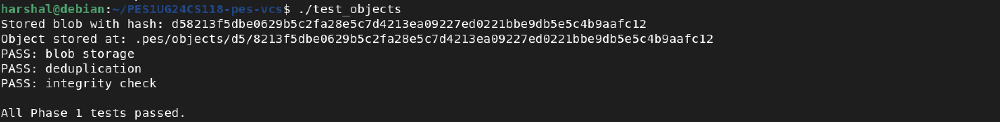
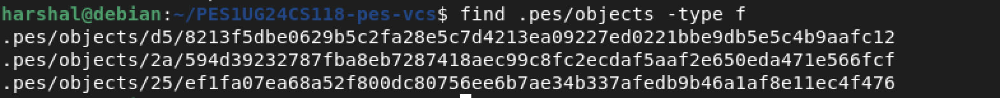
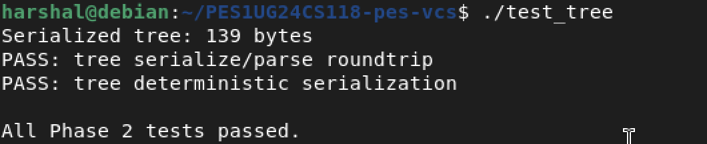
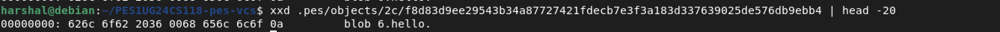
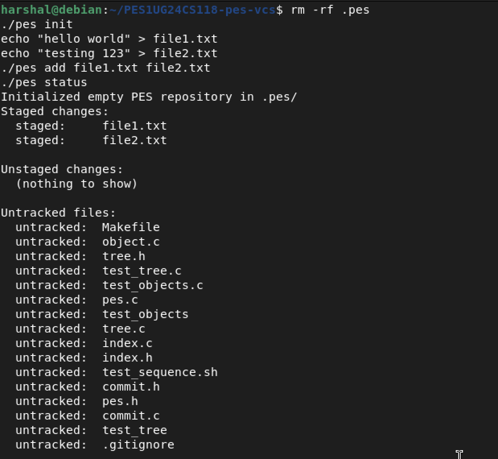
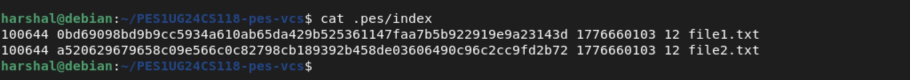
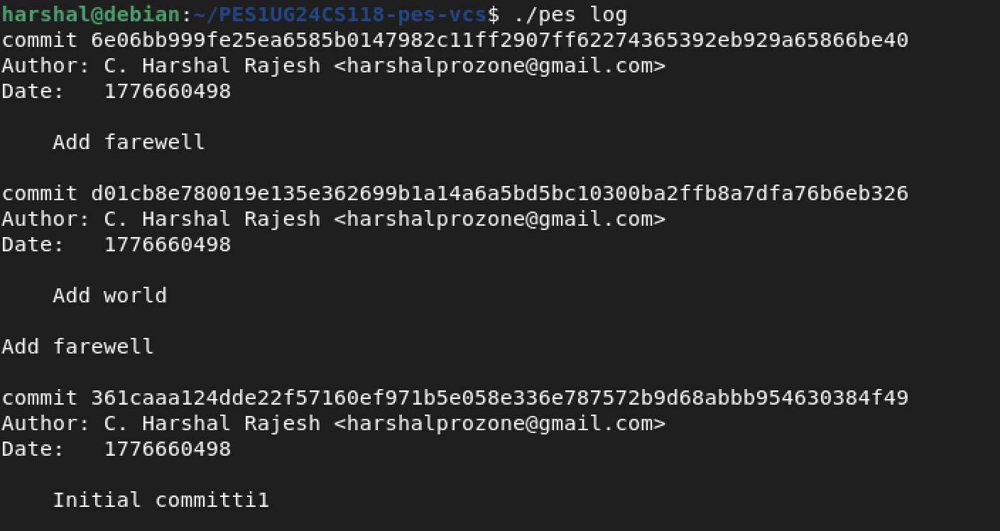
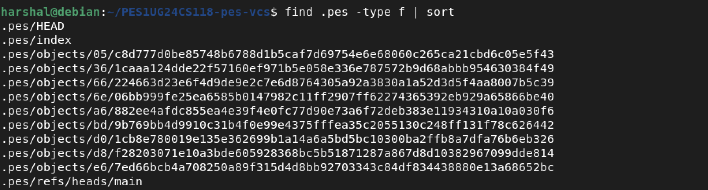
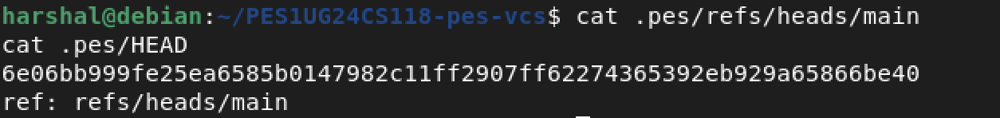

# PES-VCS — Lab Report
**Name:** C. Harshal Rajesh  
**SRN:** PES1UG24CS118  
**Repository:** PES1UG24CS118-pes-vcs

---

## Table of Contents
- [Phase 1: Object Storage](#phase-1-object-storage)
- [Phase 2: Tree Objects](#phase-2-tree-objects)
- [Phase 3: Index / Staging Area](#phase-3-index--staging-area)
- [Phase 4: Commits and History](#phase-4-commits-and-history)
- [Phase 5: Branching and Checkout (Analysis)](#phase-5-branching-and-checkout-analysis)
- [Phase 6: Garbage Collection (Analysis)](#phase-6-garbage-collection-analysis)

---

## Phase 1: Object Storage

### Screenshot 1A — `./test_objects` output



All Phase 1 tests pass: blob storage, deduplication, and integrity check.

### Screenshot 1B — Sharded object directory structure



Objects are stored under `.pes/objects/XX/YYY...` where the first two hex characters of the SHA-256 hash form the subdirectory name.

---

## Phase 2: Tree Objects

### Screenshot 2A — `./test_tree` output



All Phase 2 tests pass: serialize/parse roundtrip and deterministic serialization.

### Screenshot 2B — Raw binary tree object (`xxd`)



Each entry in the binary tree format is: `<mode> <n>\0<32-byte-hash>`.

---

## Phase 3: Index / Staging Area

### Screenshot 3A — `pes init` → `pes add` → `pes status`



After initializing the repo and staging two files, `pes status` correctly shows staged changes.

### Screenshot 3B — `cat .pes/index`



The index is stored as a human-readable text file: `<mode> <hash-hex> <mtime> <size> <path>`.

---

## Phase 4: Commits and History

### Screenshot 4A — `./pes log` showing three commits



Three commits shown in reverse chronological order with hash, author, timestamp, and message.

### Screenshot 4B — `find .pes -type f | sort`



After three commits, the object store contains blobs, trees, and commit objects.

### Screenshot 4C — `cat .pes/refs/heads/main` and `cat .pes/HEAD`



`refs/heads/main` contains the latest commit hash. `HEAD` contains `ref: refs/heads/main`.

---

## Phase 5: Branching and Checkout (Analysis)

### Q5.1 — How would `pes checkout <branch>` work?

**Files that need to change in `.pes/`:**
- `.pes/HEAD` must be updated to: `ref: refs/heads/<branch>`
- Working directory files must be updated to match the target branch's tree snapshot.

**Step-by-step process:**
1. Read the target branch's commit hash from `.pes/refs/heads/<branch>`
2. From that commit, read the root tree hash
3. Walk the current HEAD's tree and the target tree simultaneously
4. For each file:
   - Exists in target but not current → **create** it
   - Exists in current but not target → **delete** it
   - Exists in both but hashes differ → **overwrite** with target blob content
5. Update `.pes/HEAD` to `ref: refs/heads/<branch>`

**What makes it complex:**
- Recursive directory handling for nested trees
- Conflict detection — must refuse if user has uncommitted changes to files that differ between branches
- Atomicity — partial failure leaves repo in broken state
- Tracking new/deleted directories, not just files

---

### Q5.2 — Detecting a "dirty working directory" conflict

**Algorithm using only the index and object store:**

1. For each file in the index, re-hash it from disk and compare to the stored hash. If they differ → **unstaged changes exist**
2. For each file that differs between current and target branch trees: if that file also has unstaged changes → **conflict → abort checkout**
3. Files in the index but deleted from disk also count as dirty

A conflict exists only when a file is both *modified locally* AND *different between branches*. If both branches agree on a file, local changes are safe.

---

### Q5.3 — Detached HEAD

**What it means:** `.pes/HEAD` contains a raw commit hash directly instead of `ref: refs/heads/<branch>`. Happens when you checkout a specific commit instead of a branch name.

**What happens if you commit in this state:**
- New commits are created correctly with parent pointers
- But no branch reference is updated — commits are only reachable via HEAD
- Switching branches makes those commits **unreachable** and eligible for garbage collection

**How to recover:**
```bash
# If you remember the hash
echo "<commit-hash>" > .pes/refs/heads/recovery-branch
```
Without a reflog, recovery is very difficult. Best practice: create a branch before committing in detached HEAD state.

---

## Phase 6: Garbage Collection (Analysis)

### Q6.1 — Algorithm to find and delete unreachable objects

**Mark phase:**
1. Start from every branch in `.pes/refs/heads/`
2. Walk each commit chain following parent pointers
3. For each commit, recursively add all tree and blob hashes to a **HashSet**

**Sweep phase:**
1. Walk every file under `.pes/objects/`
2. If its hash is not in the HashSet → delete it

**Data structure:** A `HashSet<string>` — O(1) insert and lookup, naturally deduplicates shared objects.

**Estimate for 100,000 commits, 50 branches:** ~1.1 million objects to visit. The visited-set prevents reprocessing shared objects across branches.

---

### Q6.2 — Race condition between GC and a concurrent commit

**The race condition:**
1. Commit writes a new blob to disk — not yet referenced by any branch
2. GC runs, doesn't find the blob in any reachable tree → marks it unreachable
3. GC deletes the blob
4. Commit continues, creates a tree referencing the now-deleted blob → **repository corrupt**

**How real Git avoids this:**
- Objects are always written before any reference points to them (write-then-link order)
- Git's GC has a **2-week grace period** — never deletes objects newer than 2 weeks, giving in-progress operations time to complete safely

---

*Report submitted for OS Unit 4 Lab — PES University*
